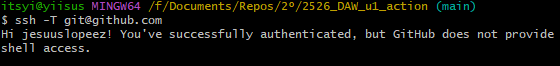

# 1. Actividad: *GitHub Actions: entendiendo Workflow.*

## 🎯 Objetivos de aprendizaje

* Comprender la estructura de un workflow (`on`, `jobs`, `steps`).

   * Ejecutar tests automáticamente en GitHub.
   * Automatizar la actualización del `README.md` con el resultado.
 
* Explorar mejoras progresivas para descubrir el potencial de GitHub Actions.

---

## 📝 Contexto

Partimos de un **repositorio base** que contiene:

* Un programa sencillo (`main.py`).
* Un test unitario (`test_main.py`).
* Un script (`update_readme.py`) que ejecuta los tests y modifica el `README.md`, con el resultado de ejecutar los test.
* El workflow básico (`ci.yml`) que ejecuta el script y hace commit automático con `git-auto-commit-action`.

---

## 🔹 Parte 1: Workflow básico. Ya implementado.

1. El alumno clona el repositorio base.
2. Comprende el contenido del script y del workflow.
3. Ejecuta el workflow manualmente y comprueba que el `README.md` se actualiza con una de estas dos salidas:

   * ✅ *Tests correctos*
   * ❌ *Tests fallidos*

---

## 🔹 Parte 2: Mejora obligatoria (nivel básico)

Cada alumno debe implementar al menos una de estas mejoras:

* **Historial de resultados en el README:** en lugar de sobrescribir, añadir nuevas líneas con fecha/hora.
* **Generar un archivo `report.md`:** con más detalles de la ejecución (tests pasados, fallidos, tiempo).

---

## 📑 Entregables

Cada alumno debe entregar:

1. Enlace a su repositorio con el workflow funcionando.
2. Evidencia en el historial de commits de:

   * Al menos un test correcto y uno fallido de la solución entregada.
   * Una mejora implementada (historial, report.md, badge o equivalente).
3. Breve documento (README_mejora.md) explicando:

   * Qué mejoras ha implementado.
   * Qué hace tu workflow.

---

## 📌 Evaluación (rúbrica simplificada)

* ✅ Workflow básico funciona y modifica el README.
* ✅ Al menos una mejora implementada.
* ✅ Explicación clara del funcionamiento y ventajas.


---

# 2. SOLUCIÓN: "GitHub Actions + Python Script + Auto Commit"

## 📝 Preparación del repositorio base

Estructura:

```
mi-proyecto-actions/
 ├── main.py
 ├── test_main.py
 ├── update_readme.py   👈 nuevo script
 └── README.md
```


### README.md inicial   

Una posible versión base del fichero README.md sería el siguiente (aunque finalmente será mas completo): 


```markdown
# Mi Proyecto con GitHub Actions

Este proyecto sirve para aprender a usar GitHub Actions 🚀

## 3stado de los tests
*Aún no ejecutados...*
```

### main.py   

Un ejemplo básico, que contiene una función saludo.  Puedes modificar la función cuando quieres que falle. 

```python
def saludo(nombre: str) -> str:
    return f"Hola, {nombre}!"
```

### test\_main.py    

Un test básico. 

```python
from main import saludo

def test_saludo():
    assert saludo("Mundo") == "Hola, Mundo!"
```

---

## 🐍 Script en Python (`update_readme.py`)

Script en python. Este script ejecuta los tests y actualiza el README:

```python
import subprocess

def run_tests():
    try:
        subprocess.check_call(["pytest", "-q"])
        return "✅ Tests correctos"
    except subprocess.CalledProcessError:
        return "❌ Tests fallidos"

def update_readme(status: str):
    with open("README.md", "r", encoding="utf-8") as f:
        lines = f.readlines()

    new_lines = []
    for line in lines:
        new_lines.append(line)
        if line.strip() == "## Estado de los tests":
            new_lines.append(status + "\n")
            break

    with open("README.md", "w", encoding="utf-8") as f:
        f.writelines(new_lines)

if __name__ == "__main__":
    status = run_tests()
    update_readme(status)
```

👉 Lo que hace:

1. Ejecuta los tests con `pytest`.
2. Según el resultado, genera un estado ✅ o ❌.
3. Modifica el `README.md` justo debajo de la sección `## 3stado de los tests`.

---

## ⚙️ Workflow (`.github/workflows/ci.yml`)

El workflow que gúía el github action:   

```yaml
name: CI con AutoCommit

on:
  push:
    branches: [ "main" ]
  workflow_dispatch:

permissions:
  contents: write   # 👈 IMPORTANTE: permite que el bot pueda hacer commits/push

jobs:
  test-and-update:
    runs-on: ubuntu-latest
    steps:
      - name: Checkout repo
        uses: actions/checkout@v3

      - name: Configurar Python
        uses: actions/setup-python@v4
        with:
          python-version: '3.10'

      - name: Instalar dependencias
        run: pip install pytest

      - name: Ejecutar script de tests y actualizar README
        run: python update_readme.py

      - name: Commit automático del README
        uses: stefanzweifel/git-auto-commit-action@v5
        with:
          commit_message: "Update README con estado de tests"
          file_pattern: README.md
```

---

## 🚦 Flujo de la actividad

1. Cuando se haga un **push** en `main`.
2. Se le da permiso de escritura para hacer commits/push al repositorio.
3. El workflow ejecuta el script en Python.
4. El script corre los tests y modifica el `README.md`.
5. La acción `git-auto-commit-action` hace commit automático con los cambios.
6. El alumno ve en el repo cómo el `README.md` se actualiza con:
    
    * ✅ Tests correctos
    * ❌ Tests fallidos

---

# 3. POSIBLES MEJORAS AL EJEMPLO ANTERIOR

La idea es que no solo no repitais el ejemplo, sino que **investigueis, mejoreis y veais el potencial real de GitHub Actions**. Para ello se piden funcionalidades **extra e imaginativas**. Aqui teneis varias propuestas, de más sencillas a más potentes, todas pensadas para que veais ventajas prácticas:

---

## 💡 Mejoras propuestas para el Action

### 1. **Historial en el README**

* Que en lugar de sobrescribir el estado, **guarden un histórico** en el README:
  
  ```markdown
  ## 3stado de los tests
  - ✅ 2025-09-22 18:00 - Tests correctos
  - ❌ 2025-09-22 17:45 - Tests fallidos
  ```
  
* 👉 Aprenderás a  **manejar fechas** y a **modificar archivos de forma acumulativa**.

---

### 2. **Generar un `report.md` con detalles**

* Crear un archivo `test-report.md` con:
    
    * Número total de tests.
    * Tests pasados y fallidos.
    * Tiempo de ejecución.

* 👉 Aprenderás a  **exportar resultados de procesos** y tener **documentación viva** del proyecto.

---

### 3. **Badges automáticos en README**

* Añadir un **badge** dinámico al README con el estado:
    
    * Verde = Tests correctos
    * Rojo = Tests fallidos
* Usando [shields.io](https://shields.io/) o generando un badge local en SVG.

* 👉 Entenderás cómo **mejorar la comunicación del estado** de un proyecto.

---

### 4. **Notificaciones externas**

* Enviar el resultado a:
    
    * **Slack/Discord** (webhook sencillo).
    * **Email** (con una acción de envío).

* 👉 Descrubrirás que Actions también sirve para **integrar con herramientas externas**.

---

### 5. **Ejecutar en múltiples entornos (matrix)**

* Hacer que los tests se ejecuten en:
    
    * Varias versiones de Python (`3.8`, `3.9`, `3.10`).
    * O en Linux y Windows.
     
* 👉 Verás la potencia del `strategy.matrix` y comprobarás compatibilidad multiplataforma.

---

### 6. **Programar ejecución automática**

* Añadir `schedule` para que se ejecute cada día a medianoche.
* El README mostraría:
  
  ```
  ✅ Última comprobación automática: 2025-09-22 00:00
  ```

* 👉 Aprenderás a **programar tareas recurrentes**.

---

### 7. **Generar una página web de resultados**

* Publicar los resultados en GitHub Pages (`gh-pages`) usando `peaceiris/actions-gh-pages`.
* 👉 Visualizarás cómo GitHub Actions puede hacer **CI/CD real** (tests + despliegue).

---

### 8. **Crear Issues automáticos si fallan los tests**

* Si un test falla → abrir un **issue automático** en el repositorio:
  
  ```yaml
  - uses: actions/github-script@v7
    with:
      script: |
        github.issues.create({
          owner: context.repo.owner,
          repo: context.repo.repo,
          title: "❌ Tests fallidos",
          body: "Se han detectado errores en los tests. Revisa el último commit."
        })
  ```
* 👉 Aprenderás a **automatizar la gestión de incidencias**.

---

## 🎯 Aprendizaje con estas mejoras

Con estas extensiones conseguireis:

* Experimentar **cómo GitHub Actions conecta piezas del desarrollo real** (tests, docs, issues, notificaciones, despliegues).
* Entender la **ventaja competitiva** de CI/CD: feedback inmediato, documentación viva y automatización.
* Pasar de un ejemplo didáctico a un flujo de trabajo que se parece mucho al que usan empresas reales.

---

# Mi Proyecto con GitHub Actions

Este proyecto sirve para aprender a usar GitHub Actions 🚀

## Estado de los tests
✅ Tests correctos

## a) Herramientas usadas para generar documentación y comandos ejecutados.
- Las herramientas utilizadas han sido PDOC y PYDOC, PDOC para la documentación en HTML y PYDOC para la documentación en MD

## b) Ejemplos de código documentado
https://github.com/jesuuslopeez/2526_DAW_u1_action/blob/23b74928173f46d86220d02d7470d6f3a7415f7a/main.py#L1-L36

## c) Formatos generados

## d) Explicación breve del workflow 
- Checkout para descargar el código del repositorio
- Configurar la versión 3.11 de python
- Instalar pdoc y pydoc con pip
- Generar documentaciones
- Hacer commit y push

## e) Mensajes de commit
- Add GitHub Actions workflow to greet in Spanish
- Delete .github/workflows/hello.yml
- Create docs.yml
- Cambio contenido main.py

## f) Evidencia de configuración SSH para GitHub


## g) Cómo clonar/usar el repositorio para reproducir la generación de documentación.
- git clone git@github.com:jesuuslopeez/2526_DAW_u1_action.git
- pip install pydoc pdoc
- python -m venv .venv
- source venv/bin/activate

## Identificación de herramientas de generación de documentación.
- Pydoc
- Pdoc

## Documentación de componentes.
https://github.com/jesuuslopeez/2526_DAW_u1_action/blob/23b74928173f46d86220d02d7470d6f3a7415f7a/main.py#L1-L36

## Multiformato
El otro formato ha sido MarkDown
    python -m pydoc main > docs/md/main.md
    python -m pydoc src.test_runner > docs/md/test_runner.md
    python -m pydoc src.generators > docs/md/generators.md
    python -m pydoc src.utils > docs/md/utils.md

Utilice MD porque es uno de los lenguajes de marcas más utilizados y de los mejores en cuanto lo visual.
